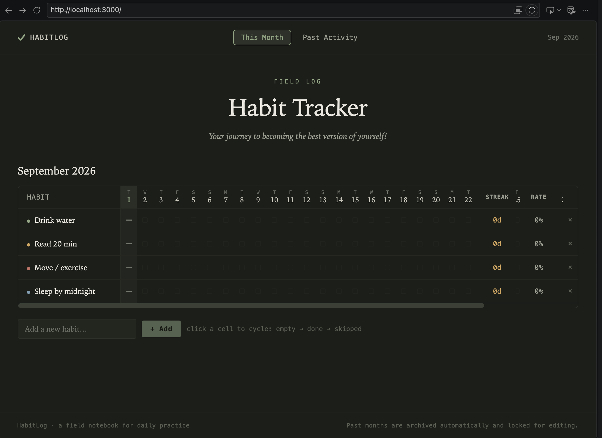
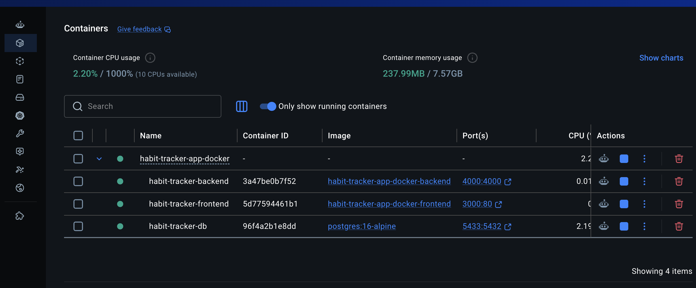

# Habit Tracker

A full-stack habit tracking application with a React frontend and .NET backend. Track your daily habits with visual indicators and browse historical data.



## Features

- 📅 **Current Month Tracking** — Mark habits as done, skipped, or unmarked for the current month
- 📊 **Past Activity View** — Browse historical habit data from previous months
- 🐳 **Docker Ready** — Full Docker Compose setup for seamless deployment
- 💪 **Robust Backend** — ASP.NET Core API with PostgreSQL database

## Project Structure

```
├── src/                        # React frontend (TypeScript)
│   ├── components/            # Reusable React components
│   ├── pages/                 # Page-level components
│   ├── hooks/                 # Custom React hooks
│   ├── api/                   # API client functions
│   └── utils/                 # Utility functions
├── server-dotnet/             # ASP.NET Core backend
│   ├── HabitTracker.Api/
│   │   ├── Controllers/       # API endpoints
│   │   ├── Models/            # Data models
│   │   └── Services/          # Business logic
│   ├── migrations/            # Database schema
│   └── SETUP.md               # Backend setup guide
├── docker-compose.yml         # Docker orchestration
├── Dockerfile                 # Frontend build configuration
└── nginx.conf                 # Reverse proxy configuration
```

## Quick Start with Docker

The easiest way to run the entire application is with Docker Compose.

### Prerequisites

- Docker and Docker Compose installed

### Steps

1. **Clone or navigate to the project directory:**
   ```bash
   cd habit-tracker-app
   ```

2. **Start all services (PostgreSQL database, .NET backend, and React frontend):**
   ```bash
   docker compose up --build -d
   ```

3. **Access the application:**
   - Open your browser and navigate to `http://localhost:3000/`
   - The frontend will connect to the backend API at `http://localhost:4000/api`

4. **View logs:**
   ```bash
   docker compose logs -f
   ```

5. **Stop services:**
   ```bash
   docker compose down
   ```

6. **Stop services and remove data:**
   ```bash
   docker compose down -v
   ```

### Initial Setup

When using Docker Compose, the database is automatically initialized with:
- Base schema from `server-dotnet/migrations/001_init.sql`
- Optional sample data from `server-dotnet/migrations/002_seed_sample_entries.sql`

## API Endpoints

The backend provides REST API endpoints for:

- **GET /api/habits** — List all habits
- **POST /api/habits** — Create a new habit
- **GET /api/entries** — Get entries for a specific month
- **POST /api/entries** — Log a habit entry
- **PUT /api/entries/:id** — Update a habit entry

Refer to the backend implementation for complete endpoint documentation:
- [server-dotnet/HabitTracker.Api/Controllers/](server-dotnet/HabitTracker.Api/Controllers/)

## Environment Variables

### Frontend

- `VITE_API_BASE_URL` — Base URL for the backend API (default: `http://localhost:4000/api`)

### Backend (.NET)

- `ConnectionStrings__Default` — PostgreSQL connection string

## Technologies Used

### Frontend
- **React** 18.3
- **TypeScript** 5.5
- **Vite** 5.3
- **React Router** 6.25

### Backend
- **.NET** 8+
- **ASP.NET Core**
- **C#**

### Database
- **PostgreSQL** 16

### DevOps
- **Docker** & **Docker Compose**
- **Nginx** (reverse proxy)

## Architecture



```
┌─────────────────────────────────────────────────────────────┐
│                    User Browser                              │
└──────────────────────────┬──────────────────────────────────┘
                           │ HTTP
                           ▼
┌─────────────────────────────────────────────────────────────┐
│           Nginx Reverse Proxy (Port 80)                      │
│  ├─ / → Frontend (React)                                    │
│  └─ /api → Backend API (Port 4000)                          │
└──────────────────────────┬──────────────────────────────────┘
                 ┌─────────┴──────────┐
                 │                    │
                 ▼                    ▼
        ┌────────────────┐  ┌────────────────┐
        │    Frontend    │  │    Backend     │
        │ (React + Vite) │  │   (.NET Core)  │
        └────────────────┘  └────────┬───────┘
                                     │
                                     ▼
                            ┌────────────────┐
                            │   PostgreSQL   │
                            │   Database     │
                            └────────────────┘
```


## Run locally without Docker

**Prerequisites**
- .NET 10 SDK
- Node.js (18+ recommended)
- npm or yarn
- PostgreSQL (recommended)

**Quick start:**

1) Run the backend

```bash
cd server-dotnet/HabitTracker.Api
dotnet restore
dotnet run
```

The API defaults to: http://localhost:4000 (see `server-dotnet/HabitTracker.Api/Properties/launchSettings.json`).

2) Run the frontend (from root directory)

```bash
npm install
npm run dev
```

Open the frontend app at the address printed by Vite (usually http://localhost:5173).

## Database / Migrations

This project is built for PostgreSQL. SQL migration scripts live in the `server-dotnet/migrations/` folder (`001_init.sql`, `002_seed_sample_entries.sql`) and target Postgres. Apply them against your Postgres database before running the API. Database configuration is in `server-dotnet/HabitTracker.Api/appsettings.json`.